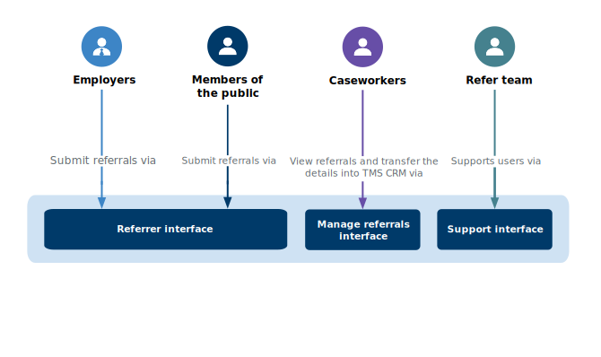
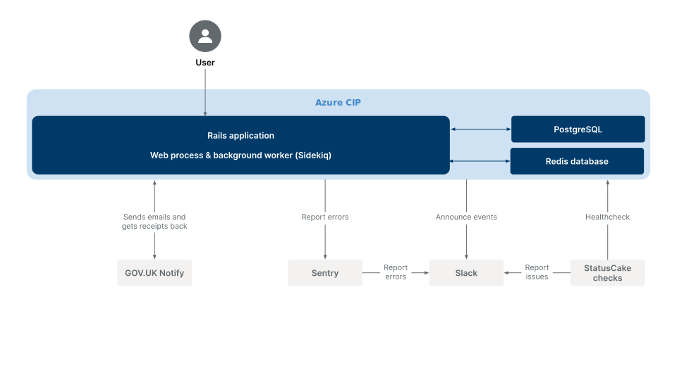

# Refer serious misconduct by a teacher

A service that allows people to refer a teacher for serious misconduct.

## Live environments

### Links and application names

| Name       | URL                                                        |
| ---------- | ---------------------------------------------------------- |
| Production | https://refer-serious-misconduct.education.gov.uk/         |
| Preprod    | https://preprod.refer-serious-misconduct.education.gov.uk/ |
| Test       | https://test.refer-serious-misconduct.education.gov.uk/    |
| Dev        | https://dev.refer-serious-misconduct.education.gov.uk/     |

All environments have continuous deployment, the state of which can be inspected in Github Actions.

### Details and configuration

| Name       | Description                                   |
| ---------- | --------------------------------------------- |
| Production | Public site                                   |
| Preprod    | For internal use by DfE to test deploys       |
| Test       | For external use by 3rd parties to run audits |
| Dev        | For internal use by DfE for testing           |

## Dependencies

- Ruby 3.x
- Node.js 16.x
- Yarn 1.22.x
- PostgreSQL 13.x
- Redis 6.x

## Local development dependencies

- Graphviz 2.22+ (brew install graphviz) to generate the [domain model diagram](#domain-model)

## How the application works

Refer serious misconduct is a monolithic Rails app built with the GOVUK Design System.

The application has a number of different interfaces for different types of users:



### Architecture



We keep track of architecture decisions in [Architecture Decision Records
(ADRs)](/adr/).

We use `rladr` to generate the boilerplate for new records:

```bash
bin/bundle exec rladr new title
```

## Setup

### Bare metal

Install dependencies using your preferred method, using `asdf` or `rbenv` or `nvm`. Example with `asdf`:

```bash
# The first time
brew install asdf # Mac-specific
asdf plugin add azure-cli
asdf plugin add ruby
asdf plugin add nodejs
asdf plugin add yarn
asdf plugin add postgres
asdf plugin add redis

# To install (or update, following a change to .tool-versions)
asdf install
```

If installing PostgreSQL via `asdf`, you may need to set up the `postgres` user:

```bash
pg_ctl start
createdb default
psql -d default
> CREATE ROLE postgres LOGIN SUPERUSER;
```

If the install step created the `postgres` user already, it won't have created one
matching your username, and you'll see errors like:

`FATAL: role "username" does not exist`

So instead run:

```bash
pg_ctl start
createdb -U postgres default
```

You might also need to install `postgresql-libs`:

```bash
sudo apt install libpq-dev
sudo pacman -S postgresql-libs
sudo pamac install postgres-libs
sudo yum install postgresql-devel
sudo zypper in postgresql-devel
```

If installing Redis, you'll need to start it in a separate terminal:

```bash
redis-server
```

Setup the project (re-run after `Gemfile` or `package.json` updates, automatically restarts any running Rails server):

```bash
bin/setup
```

Run the application on `http://localhost:3000`:

```bash
bin/dev
```

If you get redirected to ` https://www.gov.uk/government/publications/teacher-misconduct-referral-form` when trying to access `http://localhost:3000`, you might want to consider adding the `:eligibility_screener` flag.

One way to do this is by using the rails console:

```bash
FeatureFlags::Feature.create(name: :eligibility_screener, active: true)
```

### Notify

If you want to test and simulate sending emails locally, you need to be added
to the TRA digital Notify account. Then, go to
`API integration > API keys > Create an API key` and create a new key, such as
`Myname - local test` and set the type to `Test - pretends to send messages`.

Add this key to your local development secrets:

```bash
$ vim .env.development.local
GOVUK_NOTIFY_API_KEY=theo__local_test-abcefgh-1234-abcdefgh
```

When you send an email locally, the email should appear in the message log in
the Notify dashboard in the `API integration` section.

_Note:_ You can set `GOVUK_NOTIFY_API_KEY=fake-key` when running locally if you don't need to use Notify.

### Docker

To run the application locally in production mode (to test that the container
builds and runs successfully):

```bash
docker build .
docker run --net=host --env-file .env.development <SHA>
```

### Linting

To run the linters:

```bash
bin/lint
```

### Testing

To compile assets up front (needed by the end to end tests):

```bash
bin/rails assets:precompile
```

To run the tests (requires Chrome due to
[cuprite](https://github.com/rubycdp/cuprite)):

```bash
bin/test
```

### Intellisense

[solargraph](https://github.com/castwide/solargraph) is bundled as part of the
development dependencies. You need to [set it up for your
editor](https://github.com/castwide/solargraph#using-solargraph), and then run
this command to index your local bundle (re-run if/when we install new
dependencies and you want completion):

```sh
bin/bundle exec yard gems
```

You'll also need to configure your editor's `solargraph` plugin to
`useBundler`:

```diff
+  "solargraph.useBundler": true,
```

## Licence

[MIT Licence](LICENCE).
